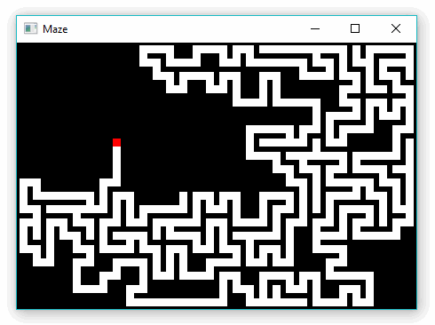
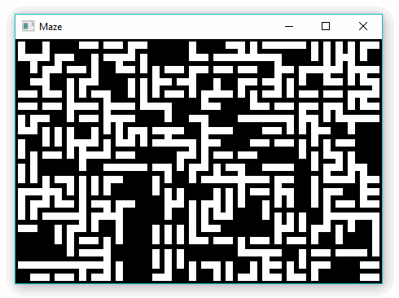

# Maze with SFML

In this repo I share my implementation of making mazes with C++, with SFML (version 2.4.2) as the graphic library. In the maze, each cell is represented by a struct called `Node`, with basic property (`walls`) of telling what sides of that cell are "blocked".

I will attempt to implement algorithms related to maze generation and maze solving.

<!--
NOTE gif image size is 490x366
The program on preview has been slowed down
-->

## Backtracking Algorithm

This algorithm is used to generate maze. I followed the description in this [Wikipedia](https://en.wikipedia.org/wiki/Maze_generation_algorithm#Recursive_backtracker) page. Here is the preview of my program:

## Kruskall Algorithm

This algorithm is used to generate maze. I followed the description in this [Wikipedia](https://en.wikipedia.org/wiki/Kruskal%27s_algorithm) page and on this [blog](http://weblog.jamisbuck.org/2011/1/3/maze-generation-kruskal-s-algorithm). Here is the preview of my program:

## Wall Following

This algorithm is used to solve maze. The maze generation is done using backtracking algorithm (but not displayed). I followed the description on this [Wikipedia](https://en.wikipedia.org/wiki/Maze_solving_algorithm#Wall_follower) page. Here is the preview of my program:

## Randomized Prim's Algorithm

This algorithm is used to generate maze. I followed the description in this [Wikipedia](https://en.wikipedia.org/wiki/Maze_generation_algorithm#Randomized_Prim's_algorithm) page. Here is the preview of my program:

